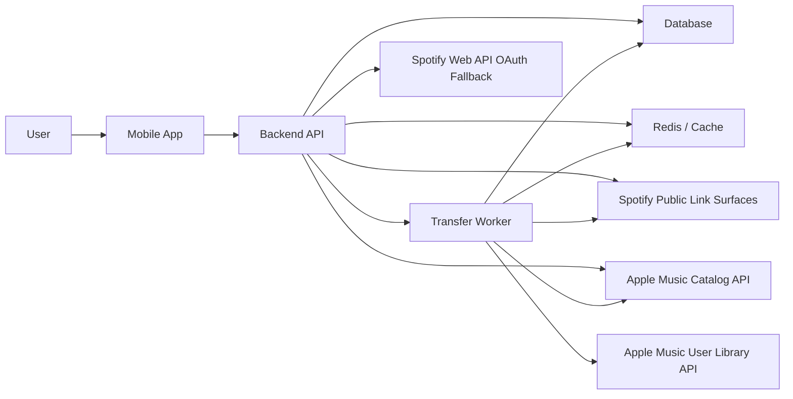
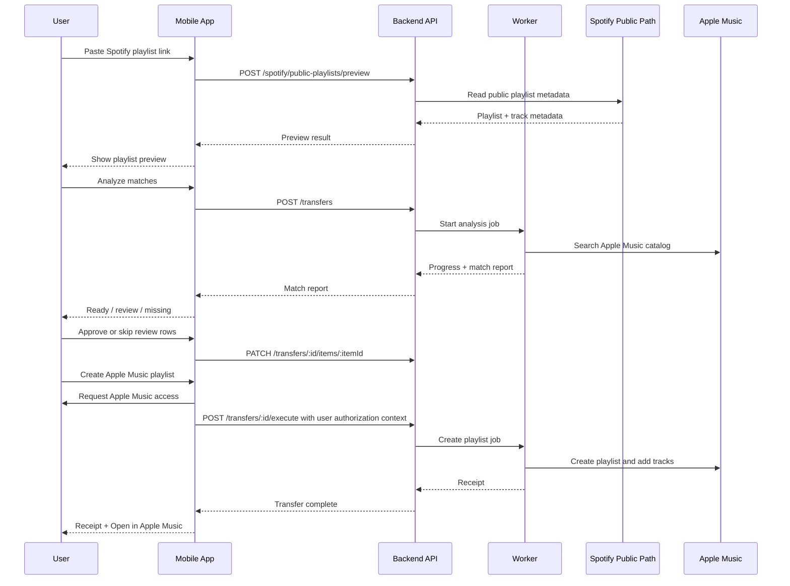

# Product Architecture

Last reviewed: 2026-05-08

## Purpose

This document defines the target architecture for turning the validated local PlaylistTransfer spike into a production mobile app.

The current prototype proves the hardest product loop:

1. Read a public Spotify playlist link.
2. Normalize track metadata.
3. Match tracks against Apple Music.
4. Let the user review uncertain matches.
5. Create an Apple Music playlist from confident or approved matches.
6. Show a clear receipt for what moved and what did not.

The next architecture should preserve that trust-first loop while moving secrets, long-running work, retries, and platform-specific auth into the right places.

## Architecture Decision

Build PlaylistTransfer as a mobile-first product with a backend orchestration layer.

The recommended production shape is:

- Native or React Native mobile app for iOS first, Android second.
- Backend API for public Spotify ingestion, Apple developer token generation, transfer jobs, match caching, and reporting.
- Background worker for large playlist imports, Apple Music matching, playlist creation, retries, and backoff.
- Database for transfer records, per-track decisions, match cache, token references, and audit history.
- Local web prototype remains an engineering sandbox, not the production UI.

This is intentionally not a pure client-side app. A client-only architecture would expose secrets, make long-running jobs fragile, make rate-limit handling harder, and lose valuable match-learning data across users.

## Product Principles That Shape The System

- Login should happen as late as possible.
- Spotify login should not be required for the core MVP when public-link ingestion works.
- Apple Music authorization should be requested when the user is about to create a playlist, not before previewing a Spotify link.
- Nothing writes to Apple Music until the user sees the match report.
- The system should explain misses, uncertain matches, and skipped tracks.
- Every transfer should end with a receipt.

## Platform Constraints

These are the major external constraints that shape the architecture.

| Platform | Constraint | Product implication |
| --- | --- | --- |
| Spotify Web API | Official OAuth access is gated by app mode. New apps start in development mode, and Spotify documents a small allowlist for development apps plus a review path for broader quota. | Treat Spotify OAuth as an optional fallback, not the first MVP dependency. |
| Spotify mobile OAuth | Spotify recommends Authorization Code with PKCE for mobile or clients that cannot safely store a client secret. | If Spotify OAuth is added later, use PKCE from the app and keep refresh-token handling server-side if we need durable jobs. |
| Spotify public web surfaces | The current prototype reads public playlist metadata from Spotify public/embed web surfaces and public web-client endpoints. This is technically validated but not an official stable API contract. | Public-link ingestion must be wrapped with observability, fixtures, fallback UX, and a kill switch. |
| Apple Music catalog search | Apple Music API catalog requests require a developer token. Catalog search can happen before user-library write authorization. | Match analysis can run before asking for Apple Music user authorization. |
| Apple Music library writes | Apple Music API requires a Music User Token for user-specific library access and playlist creation. MusicKit handles user authorization on Apple platforms/web; Android needs explicit user-token handling. | Ask for Apple Music access at create time, then write only ready/approved tracks. |
| Apple developer token | Apple developer tokens are signed JWTs. Apple documents token expiration and rate limiting. | Generate/rotate developer tokens from secure backend or native MusicKit integration; do not ship private keys in app code. |

Official references:

- [Spotify quota modes](https://developer.spotify.com/documentation/web-api/concepts/quota-modes)
- [Spotify Authorization Code with PKCE](https://developer.spotify.com/documentation/web-api/tutorials/code-pkce-flow)
- [Apple Music API overview](https://developer.apple.com/documentation/applemusicapi/)
- [Apple Music developer tokens](https://developer.apple.com/documentation/applemusicapi/generating-developer-tokens)
- [Apple Music user authentication for MusicKit](https://developer.apple.com/documentation/applemusicapi/user_authentication_for_musickit)
- [Apple MusicKit service setup](https://developer.apple.com/help/account/services/musickit)

## Target System



## Service Boundaries

### Mobile App

Responsibilities:

- Accept Spotify playlist URLs from paste, share sheet, or universal link.
- Show source playlist preview.
- Show match progress.
- Show match report with ready, review, missing, and skipped groups.
- Let users approve, skip, or eventually choose alternatives.
- Request Apple Music authorization only when needed for creation.
- Show transfer receipt and open Apple Music after creation.
- Store only local session state and safe user preferences.

The mobile app should not:

- Store Apple Music private keys.
- Store Spotify client secrets.
- Scrape Spotify pages directly in production.
- Own retry logic for long-running transfer jobs.
- Be the source of truth for transfer history.

### Backend API

Responsibilities:

- Normalize inbound playlist URLs.
- Run public Spotify playlist ingestion.
- Provide a stable app-facing playlist preview API.
- Generate or broker Apple developer tokens, depending on final native implementation.
- Create transfer records.
- Expose transfer job progress.
- Persist match reports and user review decisions.
- Enforce rate limits, quotas, free-tier limits, and abuse controls.
- Keep platform-specific failures behind product-friendly errors.

### Worker

Responsibilities:

- Process large playlist ingestion and matching without blocking app sessions.
- Retry transient Spotify and Apple Music failures with backoff.
- Write Apple Music playlists and tracks.
- Resume transfer jobs safely after process restarts.
- Maintain an auditable per-track result.
- Emit progress events.

### Database

Responsibilities:

- Store transfer state.
- Store per-track source metadata, match candidates, decisions, and final status.
- Store match cache entries that can improve future transfers.
- Store user account records and token references.
- Store operational metrics needed to debug failures.

### Local Prototype

The local server in `tools/playlist-preview-server.mjs` remains useful, but it is not the production shape.

It currently combines:

- API routes
- job orchestration
- Apple Music local session state
- HTML/CSS/JS UI rendering
- demo fixture behavior

It should stay intact as the visual product lab.

### Transfer API Subproject

The app-ready backend track now lives in `apps/transfer-api`.

This subproject is intentionally separate from the local demo. It owns JSON routes, Apple Music session handoff, transfer job orchestration, and product-friendly API errors. It can evolve toward a deployable homesite/mobile backend without destabilizing the working demo UI.

Run it locally with:

```bash
npm run dev:transfer-api
```

It defaults to `http://127.0.0.1:8791`, while the demo remains on `http://127.0.0.1:8790`.

### Web App Track

The first clean product shell lives in `apps/web`.

It talks to `apps/transfer-api` through a same-origin `/api/*` proxy and keeps demo-only controls out of the product experience. This gives us a practical homesite path before committing to native mobile scaffolding, while preserving the same API contract future iOS and Android clients can use.

Run it locally with:

```bash
npm run dev:web
```

It defaults to `http://127.0.0.1:8792`.

The web app persists an anonymous session id plus the latest `transferId` in browser storage. Match reports and review decisions are restored from the Transfer API, which currently uses local SQLite scoped by `session_id` and should move to managed durable storage before production.

This anonymous session is not a user account. It is the MVP ownership boundary for jobs, saved transfers, review decisions, and runtime Apple Music user tokens. A future account system can sit above the same transfer model without changing the mobile app contract.

## Primary User Flow



## Auth Strategy

### Spotify

Default MVP path:

- Do not require Spotify login.
- Read public playlist links through the backend public-link ingestion path.
- If public ingestion fails, guide the user to make or copy the playlist into a normal public playlist and retry.

Optional fallback path:

- Add Spotify OAuth only when the public path cannot satisfy enough real-world cases.
- Use Authorization Code with PKCE for mobile login.
- Expect platform-review and quota risk before broad consumer distribution.
- Keep this path isolated behind a provider interface so the product can still work without it.

### Apple Music

Default MVP path:

- Use developer-token-backed Apple Music catalog search for matching.
- Request Music User Token only when the user creates a playlist.
- Keep the user-token lifetime and revocation behavior explicit in UX.
- Never add tracks to the user's general library unless playlist creation requires it or the user explicitly asks.

Implementation direction:

- iOS: prefer MusicKit-native authorization if building native Swift or a React Native native module.
- Web/local prototype: use MusicKit on the Web to authorize the user and pass a user token to the local backend.
- Android: plan explicit Music User Token handling according to MusicKit for Android constraints.
- Backend: generate signed developer tokens or provide a secure token endpoint; never expose private keys.

## Public Spotify Ingestion Strategy

The public path is the main product wedge because it gives the best conversion path:

1. Paste link.
2. See playlist.
3. See matches.
4. Authorize Apple Music only when ready to write.

Production hardening requirements:

- Maintain fixture playlists with expected track counts.
- Detect partial extraction and show that clearly.
- Cache playlist and track metadata for a short period.
- Add request backoff and circuit breakers.
- Instrument extraction source, row count, duplicate count, and failure reason.
- Keep a user-facing fallback flow for blocked/private/unreadable links.
- Treat the undocumented public web-client path as replaceable infrastructure, not a permanent guarantee.

## Matching Strategy

The matching pipeline should remain explainable.

Inputs:

- Spotify track ID
- title
- artist names
- album name
- duration
- ISRC when available
- source playlist position
- album artwork URL when available

Matching phases:

1. Prefer ISRC exact match when present.
2. Search Apple Music catalog using normalized title and primary artists.
3. Try alternate query shapes for remasters, live versions, featured artists, punctuation, and remix suffixes.
4. Score candidates using title similarity, artist similarity, duration proximity, album similarity, and ISRC.
5. Classify each item as ready, needs review, or missing.
6. Preserve candidate details and reason codes for the UI.

Status rules:

| Status | Meaning | Write behavior |
| --- | --- | --- |
| `ready` | High confidence match | Included by default |
| `needs_review` | Plausible but uncertain match | Excluded until approved |
| `approved` | User accepted a suggestion | Included |
| `skipped` | User chose not to transfer | Excluded |
| `missing` | No acceptable candidate | Excluded |

## Data Model

Minimum production tables:

| Table | Purpose |
| --- | --- |
| `users` | App user identity and lifecycle. |
| `provider_accounts` | Connected Apple Music and optional Spotify account metadata. |
| `transfers` | One playlist transfer attempt, current status, counts, and timestamps. |
| `transfer_items` | One row per source track, match state, decision, and destination track ID. |
| `match_candidates` | Candidate Apple Music matches for review and future alternatives. |
| `match_cache` | Reusable Spotify-to-Apple match results keyed by normalized metadata and ISRC. |
| `provider_tokens` | Encrypted token storage or references to a secret store. |
| `usage_events` | Product and operational events. |

Important data rules:

- Store only the token scopes needed.
- Encrypt provider tokens at rest.
- Separate user decisions from algorithmic match scores.
- Keep enough source metadata to generate receipts and debug support issues.
- Give users a path to delete account data.

## API Surface

Initial app-facing endpoints:

| Endpoint | Purpose |
| --- | --- |
| `POST /spotify/public-playlists/preview` | Read a public Spotify playlist link and return normalized preview metadata. |
| `POST /transfers` | Create a transfer analysis job from a playlist URL or preview payload. |
| `GET /transfers/:id` | Fetch transfer status, progress, summary, and current item states. |
| `PATCH /transfers/:id/items/:itemId` | Approve, skip, or replace a match decision. |
| `POST /transfers/:id/execute` | Create the Apple Music playlist from ready and approved items. |
| `GET /transfers/:id/receipt` | Fetch final transferred/skipped/missing counts and destination link metadata. |
| `GET /transfers/:id/export/missing.csv` | Export missing tracks for manual follow-up. |
| `POST /auth/apple/session` | Exchange or validate Apple Music user authorization context for write operations. |

Future endpoints:

- `POST /auth/spotify/start`
- `POST /auth/spotify/callback`
- `POST /imports/text`
- `POST /imports/csv`
- `GET /history`
- `DELETE /account`

## Job Model

Transfers should be asynchronous once analysis starts.

Recommended job states:

- `queued`
- `reading_source`
- `matching`
- `waiting_for_review`
- `ready_to_create`
- `creating_playlist`
- `adding_tracks`
- `complete`
- `failed`
- `cancelled`

Progress should be real enough to build trust:

- source tracks discovered
- tracks matched
- tracks pending review
- tracks added to Apple Music
- final skipped/missing counts

## App Architecture

Recommended near-term implementation:

- React Native or Expo with native escape hatches for MusicKit and share-sheet integration.
- TypeScript shared domain types between app and backend.
- App state machine for the transfer flow.
- Server-driven transfer state; local app state should be recoverable after a restart.
- Design tokens copied from the current Studio Light prototype.

Screen ownership:

| Screen | Source of truth |
| --- | --- |
| Paste link | Local input state |
| Preview | Backend preview response |
| Match report | Transfer item state from API |
| Apple authorization | Platform auth state |
| Transfer progress | Job state from API |
| Receipt | Final transfer record |

## Security And Privacy

Do:

- Keep Apple private keys and signing material out of the app.
- Encrypt user tokens at rest.
- Use short-lived session tokens for app-to-backend calls.
- Scope token access to the minimal operation needed.
- Redact tokens from logs.
- Keep receipts clear without over-collecting personal library data.

Do not:

- Log Music User Tokens.
- Store Spotify/Apple credentials in plaintext.
- Send Apple Music writes before user confirmation.
- Require Spotify login unless the selected import path truly needs it.
- Treat public Spotify extraction as a guaranteed platform contract.

## Reliability Strategy

Minimum reliability work before app-store packaging:

- Fixture suite of real public Spotify playlists.
- Golden expected counts for small, large, duplicated, generated-like, and missing-art playlists.
- Regression test for Apple Music matching without user authorization.
- Regression test for create-time Apple authorization handling.
- Smoke test for receipt and Apple Music open-link behavior.
- Backoff around Apple Music `429` responses.
- Circuit breaker around public Spotify extraction failures.

Operational metrics:

- preview success rate
- public extraction source used
- source track count
- duplicate count
- match rate
- needs-review rate
- missing rate
- Apple Music authorization completion rate
- playlist creation success rate
- p50 / p95 analysis time

## Monetization Architecture

The architecture should allow monetization without contaminating the trusted transfer flow.

Recommended hooks:

- usage counter per user/device/session
- ad-placement eligibility after non-critical steps
- subscription entitlement table
- server-side free-tier limits
- paywall copy tied to real value, not artificial failure

Avoid:

- ads during playlist creation
- hiding unmatched tracks behind paywall
- making the first successful transfer feel risky or expensive

## Migration From Current Prototype

Current production-ready pieces:

- `src/providers/spotify-public.ts`: public Spotify ingestion proof.
- `src/providers/apple.ts`: Apple Music catalog search and playlist writes.
- `src/matching/match-track.ts`: match scoring and classification.
- `src/transfer/analyze-transfer.ts`: analysis orchestration.
- `src/transfer/create-apple-playlist.ts`: write path for confident matches.
- `tools/playlist-preview-server.mjs`: validated end-to-end local UI and API behavior.

Next refactor:

1. Move route handlers out of `tools/playlist-preview-server.mjs`.
2. Move job orchestration into a reusable backend module.
3. Move local Apple session handling behind an interface.
4. Preserve the current web MVP as a thin client against those backend modules.
5. Add fixture-based regression tests before changing ingestion behavior.

## Open Questions

These decisions are still pending:

- Native Swift iOS first or React Native first?
- Does Android launch in MVP or wait until after iOS validation?
- Do we store Apple Music user tokens server-side, or keep creation session-bound for privacy?
- Do we ship Spotify OAuth fallback, or only public-link plus manual fallback?
- What is the first monetization gate: ads, one-time transfer packs, or subscription?
- How much transfer history should be stored by default?

## Recommended Next Engineering Step

Split the local MVP server into app-ready backend modules while keeping behavior unchanged.

Target commit:

```text
Restructure prototype into backend modules
```

Acceptance criteria:

- Existing local UI still works at `http://127.0.0.1:8790`.
- Public preview, analysis, review decisions, late Apple authorization, creation, receipt, and demo mode still work.
- Route logic is separated from rendering.
- Job logic is testable without the browser UI.
- No provider secrets move into client-rendered code except the developer token currently required by the local MusicKit web prototype.
